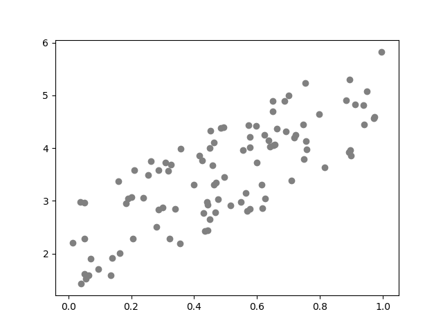

# Linear Regression

Linear Regression 就是为了找到数据的 Feature 和对应 Label 之间的线性关系，这里的线性关系可以是“广义”上的线性关系，“广义”就是说模型的输入可以是直接是数据的 Feature，也可以是 Feature 经过函数变换后的结果
。“ Regression ”的意思是说建立的模型输出不是一个类别变量，而是一个连续的、与原始的 Label 尽可能接近的实数。

最简单的线性回归是一元线性回归，即只有数据的 Feature 数量只有 1 个。可以很容易构造出这样的数据集，例如：

      import numpy as np

      def f(x):
          return 3*x + 2

      noise = np.random.uniform(-1, 1, 100)
      X = np.random.uniform(0, 1, 100)
      Y = f(X) + noise

上面的构造出的数据集画成散点图：

代码里面定义的函数的结构是 $$ 3 \times x + 2 $$，然后加入了一个高斯随机噪声，如果没有随机噪声，这里得到的所有的点都会呈现一条直线。线性回归要做的就是通过这些散落的点，找出里面的存在的线性关系。

# Model

线性回归的模型很简单，即

$$y= \mathbf{w}^T \cdot \mathbf{x} +b$$
 

下面要做的和之前的 Perceptron 一样，根据数据找到合适的 $$w$$ 和 $$b$$。这里要说明的是，从这一章节开始，黑体用来表示列向量，如上面的 \\(\mathbf{w} = \begin{bmatrix} w_1 \\\ w_2 \\\ \cdots \\\ w_k \end{bmatrix}\\)，
数据向量 \\(\mathbf{x}\\) 也类似。

如果把上面的 \\( \mathbf{x} \\) 更换成 \\((f_1(x_1), f_2(x_2), \ldots, f_k(x_k))\\) ，那么就变成了前面提到的广义线性模型。不过从常用的做法来看，这里的 \\(f_m(x)\\) 一般都是预先选择好的，而不是从数据集中“学习”得到的。
所以这种广义线性模型需要对数据进行深入的研究，才能决定何时用什么样的函数对哪几个分量进行变换。

# Learning Algorithm

这次的数据集合是由上面的代码生成的，所以这里就省去数据集说明的部分。本章节采用的例子也很简单，但是可以很容易的扩展到多维的数据上去，方法完全一样。实现 Linear Regression 的训练算法和 Perceptron 很类似，已经形成了一种
套路，分为两步：

1. 定义 Loss 函数
2. 使用 SGD 减小 Loss 函数在数据集上的值

Linear Regression 所要做的事情是通过给定的一组 Feature 值预测出它们所代表的值，这和 Perceptron 的分类任务不同，所以 Loss 函数也不同。在 Linear Regression 中，更常采用的平方 Loss 作为其损失函数，表示如下：

$$loss_i=loss(y_i,\hat{y_i}) = \frac{1}{2}(y_i - \hat y_i)^2$$
 

上面的 \\( loss_i\\) 表示的第 \\(i\\) 个数据预测结果和真实结果差距，\\(\hat y_i\\) 表示第 \\(i\\) 组 Feature 其对应的模型预测结果。具体点来说，初始情况下，把 \\(\mathbf{w}\\) 初始化成 \\(\mathbf{0}\\)，把第一个点的 Feature 值输入到模型方程中，它的输出是 0，对应的平方 Loss 就是：

$$loss_0=loss(y_0,\hat{y_0}) = (0.77918926 - 0)^2 = 0.607135$$
 
