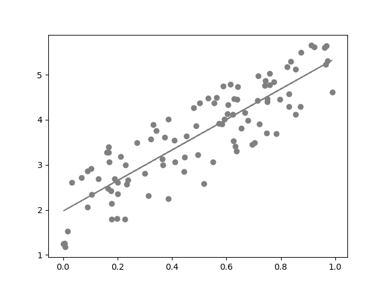

# Linear Regression

Linear Regression 就是为了找到数据的 Feature 和对应 Label 之间的线性关系，这里的线性关系可以是“广义”上的线性关系，“广义”就是说模型的输入可以是直接是数据的 Feature，也可以是 Feature 经过函数变换后的结果
。“ Regression ”的意思是说建立的模型输出不是一个类别变量，而是一个连续的、与原始的 Label 尽可能接近的实数。

最简单的线性回归是一元线性回归，即只有数据的 Feature 数量只有 1 个。可以很容易构造出这样的数据集，例如：

      import numpy as np

      def f(x):
          return 3*x + 2

      noise = np.random.uniform(-1, 1, 100)
      X = np.random.uniform(0, 1, 100)
      Y = f(X) + noise

上面的构造出的数据集画成散点图：

代码里面定义的函数的结构是 $$ 3 \times x + 2 $$，然后加入了一个高斯随机噪声，如果没有随机噪声，这里得到的所有的点都会呈现一条直线。线性回归要做的就是通过这些散落的点，找出里面的存在的线性关系。

# Model

线性回归的模型很简单，即

$$y= \mathbf{w}^T \cdot \mathbf{x} +b$$
 

下面要做的和之前的 Perceptron 一样，根据数据找到合适的 $$w$$ 和 $$b$$。这里要说明的是，从这一章节开始，黑体用来表示列向量，如上面的 \\(\mathbf{w} = \begin{bmatrix} w_1 \\\ w_2 \\\ \cdots \\\ w_k \end{bmatrix}\\)，
数据向量 \\(\mathbf{x}\\) 也类似。

如果把上面的 \\( \mathbf{x} \\) 更换成 \\((f_1(x_1), f_2(x_2), \ldots, f_k(x_k))\\) ，那么就变成了前面提到的广义线性模型。不过从常用的做法来看，这里的 \\(f_m(x)\\) 一般都是预先选择好的，而不是从数据集中“学习”得到的。
所以这种广义线性模型需要对数据进行深入的研究，才能决定何时用什么样的函数对哪几个分量进行变换。

# Learning Algorithm

这次的数据集合是由上面的代码生成的，所以这里就省去数据集说明的部分。本章节采用的例子也很简单，但是可以很容易的扩展到多维的数据上去，方法完全一样。实现 Linear Regression 的训练算法和 Perceptron 很类似，已经形成了一种
套路，分为两步：

1. 定义 Loss 函数
2. 使用 GD 减小 Loss 函数在数据集上的值

Linear Regression 所要做的事情是通过给定的一组 Feature 值预测出它们所代表的值，这和 Perceptron 的分类任务不同，所以 Loss 函数也不同。在 Linear Regression 中，更常采用的平方 Loss 作为其损失函数，表示如下：

$$loss_i=loss(y_i,\hat{y_i}) = \frac{1}{2}(y_i - \hat y_i)^2$$
 

上面的 \\( loss_i\\) 表示的第 \\(i\\) 个数据预测结果和真实结果差距，\\(\hat y_i\\) 表示第 \\(i\\) 组 Feature 其对应的模型预测结果。在平方 Loss 的求解里面还加入了一个 \\(\frac{1}{2}\\) ，这个是为了方便 GD 计算的时候，能消除掉指数 2。具体点来说，初始情况下，把 \\(\mathbf{w}\\) 初始化成 \\(\mathbf{0}\\)，把第一个点的 Feature 值输入到模型方程中，它的输出是 0，对应的平方 Loss 就是：

$$loss_0=loss(y_0,\hat{y_0}) = (0.77918926 - 0)^2 = 0.607135$$
 

这里采用的方法和 Perceptron 中有些许的不同，这次需要先求出所有数据 \\( \mathbf{X}\\) 上的平均 Loss：

$$loss_{avg} = \frac{1}{2n}\sum_i(y_i-\hat{y_i})^2$$
 

然后在 \\(loss_{avg}\\) 使用 GD 算法，求出对应的 \\(w\\) 和 \\(b\\)。

Linear Regression 其实是有 closed form 的，这个求解 closed form  的方法也是 R 工具包中求解 \\(w\\) 和 \\(b\\) 的方式。这个求解  closed form  的结论是 \\( \mathbf{w} = (\mathbf{X}^T \mathbf{X})^{-1} \mathbf{X} \mathbf{y} \\) ，这里  closed form  不一定存在的很大情况是 \\(\mathbf{X}\\) 是不可逆的。同时  closed form  的算法能处理的数据集大小和维度有限，并不适合在大规模高维度数据集上使用，一般来说人们还是会使用 GD 算法和其变种，来搜索一个数据集上尽可能合理的 \\(w\\) 和 \\(b\\) 。

# Gradient Descent

有了 $$loss_{avg}$$ 后，我们希望的就是这个 $$loss_{avg}$$ 的值越小越好，也就是我们要找合适的 \\(w\\) 和 \\(b\\)，使得 \\(loss_{avg}\\) 能够取得最小的值，这个寻找过程的求解算法和 Peceptron 的一样:

$$\begin{align}w & = w- \eta \cdot dw \\ b & = b - \eta \cdot db\\ \end{align}$$
 

\\(\eta \\) 为学习率，代表我们希望每一步走多远，分别计算之前的 \\(loss_{avg}\\) 的变量 \\(w\\) 和 \\(b\\) 所对应的 \\(dw\\) 和 \\(db\\):

$$\begin{align}dw = & - \frac{1}{n} \sum_i (y_i - \hat{y_i} ) \cdot x_i \\ db = & - \frac{1}{n} \sum_i (y_i - \hat{y_i} )\end{align}$$
 

# Implementation

首先定义 SimpleLinearRegression 类：

    class SimpleLinearRegression:
        """Simple Linear Model"""
        w = None
        b = None

        def __init__(self):
            self.b = 0

        def __call__(self, x):
            if self.w is None:
                if isinstance(x, np.ndarray):
                    self.w = np.zeros((x.shape[0]))
                else:
                    self.w = np.zeros((1,))

            return np.dot(self.w, x) + self.b

        def loss(self, y, yhat):
            return math.pow(y - yhat, 2)

        def update(self, x, y, y_hat, eta):
            n = x.shape[0]
            dw = -1 * np.dot(y - y_hat, x) / n
            db = -1 * np.sum(y - y_hat, 0) / n
            self.w = self.w - eta * dw
            self.b = self.b - eta * db

实现训练的逻辑：

    def train(model, x, y, eta = 0.1, epoch = 1):
        n = x.shape[0]
        y_hat = np.zeros((y.shape[0]))
        for i in range(epoch):
            loss = 0
            for j in range(n):
                y_hat[j] = model(x[j])
                loss += float(model.loss(y[j], y_hat[j]))

            model.update(x, y, y_hat, eta)
            print("Epoch %d, loss is: %f" % (i, loss / n))
        print("Training End.")

组合起来：

    if __name__ == "__main__":
        simplelinearmodel = SimpleLinearRegression()
        train(simplelinearmodel, X, Y, 0.01, 1000)

        plt.scatter(X, Y, color="red", linewidth=1)

        yl = np.zeros((100,))
        for i in range(100):
            yl[i] = simplelinearmodel(X[i])

        plt.plot(X, yl, color="gray", linewidth=1)
        plt.show()

        print(simplelinearmodel.w, simplelinearmodel.b)

完整代码见[这里](https://github.com/hailingu/MLFM/blob/master/code/LinearRegression.py)。

调用 scikit-learn 的话也很简单：

    from sklearn.linear_model import LinearRegression

    linear_regression = LinearRegression()
    linear_regression.fit(X.reshape((X.shape[0], 1)), Y)

最后得到的直线：

当然从统计学的角度来说，Linear Regression 远没有上面描述的这么的简单，它还涵盖了其他的许多的内容。从统计学的习惯来表示 Linear Regression 更多的是 $$y = \mathbf{x}^T \cdot \mathbf{w} + \epsilon$$

在统计学中，使用平方损失而不是其他损失是有前提假设条件的，如果满足这些条件，那么使用平方损失得到的线性模型是 BLUE 的，也就是模型是最优的，这也被称之为 Gauss-Markov 定理：

* 模型为线性关系
* 得到的数据样本是从所有可能的数据中随机抽取的
* 在样本中，没有独立变量是常数，并且独立变量之间不存在完全共线性
* 能生成所有数据的方程的误差项的均值为 0
* 误差项的方差为一个常数

在实际中，上面的这些假设条件都很难验证，即使最基本的 Feature 和 Label 之间是存在线性关系这件事都很难验证。同时在大于 3 维的情况下，基本上不可能实现一个正确的数据可视化，所以在实际中采用的做法往往是使用线性模型去拟合数据，然后再看出来的结果是否是我们想要的，如果结果能为我们所用，那么就采用这个模型，如果这个模型的结果不能用，就要尝试做一些变量的筛选、变换，构造一个新的模型。也许这个数据根本就不能用线性模型合理的表达，可很多时候往往还是采用了线性模型的方案，因为它简单，能快速的尝试。

在 Feature 只有一维的情况下，平方损失意味着你要找一条直线，使得 $$\sum (\hat{y}-y)$$ 整体的和最小。再从 $$y = \mathbf{x}^T \cdot \mathbf{w} + \epsilon$$ 这个式子来看，$$ \mathbf{w} $$ 如果本身是一个矩阵，那么 $$\mathbf{x}^T \cdot \mathbf{w} $$ 就相当于 $$ \mathbf{x} $$ 在 $$\mathbf{w}$$ 的线性空间中对 $$y$$ 的表达。换句话说，也就是要找到一个 $$ \mathbf{w} $$ 线性空间，可以用来表达整个 $$ \mathbf{x} $$ 和 $$y$$。这个空间中所有预测预测得到的 $$\hat{y}$$ 要和原始数据集中的 $$y$$ 的 Euclidean Distance 距离之和最小。这里就存在几个不确定的地方，首先就是 $$ \mathbf{x} $$ 和 $$y$$ 能不能用线性空间来表达，第二就是它们所处的空间是不是欧几里得空间。
