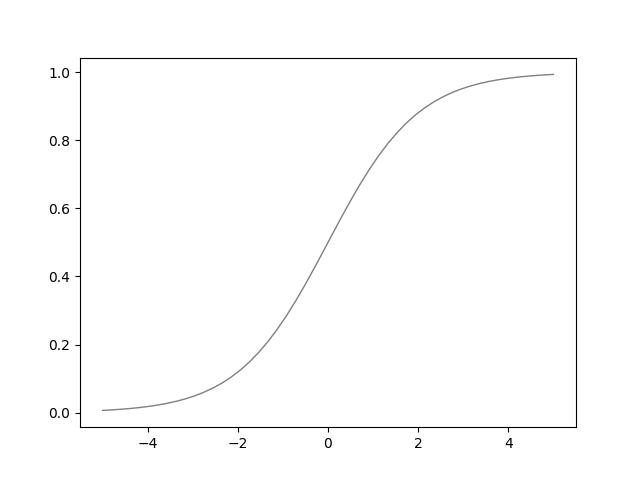

# Logistic Regression

Logistic Regression 是一个二元的分类模型，[wiki](https://en.wikipedia.org/wiki/Logistic_regression) 说它并不是一个分类器，而是一个概率模型，这个我个人持保留意见。人们在实际的工作和生活中使用 Logistic Regression 的时候更多的时候还是当一个分类器来使用。

简单点来说， Logistic Regression 将建立起一组变量表达的二元标签 $$(0，1)$$ 之间的关系。更加直观的表现的是，如果有一个数据集有标签 $$y$$ 和五个 Feature $$x_1, x_2, x_3, x_4, x_5$$ ，那么 Logistic Regression 可以用来建立起 x 和 y 之间的关系。

Logistic Regression 有很多的应用，比如用来预测美国大选大家投的是民主党还是共和党，比如在医学上有人用于受伤的人是否要死了，比如在广告中用来预测这个广告是否要投放给某个人，比如在营销中用于判断某个人是否会订阅或者购买某个产品，亦如判断一个肿瘤是良性的还是恶性的。所有这里提到的例子，都是建立起一个一组变量表达的二元标签之间的关系。

Logistic Regression 是一个很简单的模型，但也是很有效的模型，至今在很多的项目中使用到了 Logistic Regression ， 不过现在的用法不是那么的简单和直接，人们会花费更多的时间构建数据的表示上。这里第一次提到数据的表示，需要多说几句。不同的数据表示对于模型的构建影响很大，例如有的数据集在 Polar 坐标系下仅仅用简单的直线就可以分开，但是在 Cartesian 坐标系下却需要使用圆才能分开。这样的话，前者只需要构建一个线性的模型，但是后者需要构建一个非线性模型。人们在线性模型的构建上积累了很多的知识、经验、方法，但面对非线性的问题的时候，常常束手无策。所以数据的表示成为了现在工程实践中一个很重要的步骤，这个步骤再加上额外的一些对数据的处理（例如去除噪声点、插值、数据标准化等），就构成了人们口中常说的__特征工程__。

特征工程加上简单模型是过去以至于现在很多问题的主流处理方法。

# Model

Logistic Regression 的模型很简单，即将一个线性模型的结果作为 sigmoid 函数的输入，将 sigmoid 函数的输出作为最终的结果：

$$\begin{array}\ tmp = \mathbf{w}^T \cdot \mathbf{x} \\ y = \frac{1}{1 + exp(-tmp)}  \end{array}$$
 

在机器学习中，常把 $$g(x) = \frac{1}{1+e^{-x}}$$ 这样的函数叫做 sigmoid 函数，它能将整个实数集映射到 $$[0,1]$$ 区间上：

所以 Logisic Regression 可以简单的认为是 Linear Regression 加上 sigmoid 函数。

# Learning Algorithm

类似于线性回归，我们需要定义其 Loss 函数，在这里我们直接使用 log-loss 也就是极大似然取对数后的结果。那么对于单个样本的预测，单个样本的损失定义为：

$$loss(\hat{y_i},y_i)= -[ y_i log(\hat{y_i}) + (1-y_i)log(1-\hat{y_i})]$$
 

稍微分析一下上面的损失函数，我们会发现当真实的标签为 0 的时候，主要起作用是 \\(log(1-\hat{y_i})\\)，对于后面这一项，如果模型预测的 \\( \hat{y_i} \\) 越接近于 0 ，那么这个 Loss 就越小。类似的可以分析当真实的标签为 1 的情况，这个时候起作用的就是另外一项了。这里的 log-loss 有些时候也会被称之为 Cross Entropy ， 由于到目前为止，我还没有提到什么是 Entropy，所以这里还是使用 log-loss 作为这个 Loss 的名称。

当我们手上有了某一个样本的 loss 之后，我们可以得到所有样本的整体的 loss：

$$loss_i = -[ \sum_i y_i log(\hat{y_i}) + (1-y_i)log(1-\hat{y_i})]$$
 

接下来做一些推导：

$$\begin{align}
u_i=&  \mathbf{w}^T\mathbf{x}_i \\
loss_{avg} = & \frac{1}{n} -\sum_i [y_i log(\hat{y_i}) + (1-y_i)log(1-\hat{y_i})] \\
=&  - \frac{1}{n} \sum_i [y_i log e^{u_i} - y_i log(e^{u_i}+1) - (1-y_i)log(e^{u_i}+1)] \\
=&  - \frac{1}{n} \sum_i [y_i log e^{u_i} - y_i log(e^{u_i}+1) - log(e^{u_i}+1) + y_i log(e^{u_i}+1)]   \\
=&  - \frac{1}{n} \sum_i [y_i log e^{u_i} - log(e^{u_i}+1)]  \\
=&  - \frac{1}{n} \sum_i [y_i{u^i}-log(e^{u_i}+1)]   \\
\nabla u=& - \frac{1}{n} \sum_i [y_i - \frac{e^{u_i}}{e^{u_i}+1}]   \\
=&  - \frac{1}{n} \sum_i [y_i - \hat{y_i}] \\
\end{align}$$
 

所以针对每一个具体的 \\(w_j\\)，有：

$$\begin{align}
dw_j=& -\frac{\partial loss_{avg}}{\partial u}\frac{\partial u}{\partial w_j} \\
= & - \frac{1}{n} \sum_i [ y_i - \hat{y_i}]x_{ij} \\
db = & - \frac{1}{n} \sum_i [ y_i - \hat{y_i}] \\
\end{align}$$
 

# Gradient Descent

跟前面 Perceptron 和 Linear Regression 一样，使用 Gradient Descent 来搜索合适的 \\(w\\) 和 \\(b\\) :

$$\begin{align}w & = w- \eta \cdot dw \\ b & = b - \eta \cdot db\\ \end{align}$$
 

# Implementation

这里实现的时候使用的数据集和 Perceptron 中的一致，所以不做过多的说明了。

首先定义 LogisticRegression 类：

    class LogisticRegression:
        """Logistic Regression class"""
        w = None
        b = None

        def __init__(self):
            self.b = 0

        def __call__(self, x):
            if self.w is None:
                if isinstance(x, np.ndarray):
                    self.w = np.zeros((x.shape[0]))
                else:
                    self.w = np.zeros((1,))

            return sigmoid(np.dot(self.w, x) + self.b)

        def loss(self, y, yhat):
            return -1 * (np.dot(y,  np.log(yhat)) + np.dot((1-y),np.log(1-yhat)))

        def update(self, x, y, y_hat, eta):
            n = x.shape[0]
            dw = -1 * np.dot(y - y_hat, x) / n
            db = -1 * np.sum(y - y_hat, 0) / n
            self.w = self.w - eta * dw
            self.b = self.b - eta * db

定义 sigmoid 函数：

    def sigmoid(x, threshold = 0.5):
        return 1 if 1 / (1 + np.exp(-x)) > threshold else 0

定义训练函数：

    def train(model, x, y, eta = 0.1, epoch = 1):
        n = x.shape[0]
        y_hat = np.zeros((y.shape[0]))
        for i in range(epoch):
            loss = 0
            right = 0
            for j in range(n):
                y_hat[j] = model(x[j])
                loss += float(model.loss(y[j], y_hat[j]))

            model.update(x, y, y_hat, eta)
            for j in range(n):
                y_hat[j] = model(x[j])
                if y_hat[j] == y[j]:
                    right += 1

            print("Epoch %d, Right Cnt is: %f" % (i, right))

            if right == n:
              break
        print("Training End.")

组装起来：

    if __name__ == "__main__":
        data = np.array([[0.6863727, 0.17526787,  1.],
                         [0.80132839, 0.10523108, 1.],
                         [0.90775029, 0.14932357, 1.],
                         [0.80961084, 0.3694097,  1.],
                         [0.87508479, 0.60748736, 1.],
                         [0.70281723, 0.79587493, 1.],
                         [0.83433634, 0.15264152, 1.],
                         [0.93900273, 0.14149965, 1.],
                         [0.9024325,  0.5952603,  1.],
                         [0.85962927, 0.3794422,  1.],
                         [0.79602696, 0.99582496, 1.],
                         [0.91271228, 0.4730507,  1.],
                         [0.76601726, 0.5419725,  1.],
                         [0.75340131, 0.9640383,  1.],
                         [0.4891988,  0.51442063, 0.],
                         [0.17261154, 0.2748436,  0.],
                         [0.22090833, 0.86894599, 0.],
                         [0.07946182, 0.72304428, 0.],
                         [0.07177909, 0.93407657, 0.],
                         [0.27563872, 0.5806341,  0.],
                         [0.03817113, 0.79038495, 0.],
                         [0.23544452, 0.95657547, 0.],
                         [0.15161787, 0.34464048, 0.],
                         [0.30645413, 0.83393461, 0.],
                         [0.03985814, 0.28320299, 0.]])

        logistic_model = LogisticRegression()
        train(logistic_model, data[:, 0:2], data[:,2], epoch=10)

完整代码见[这里](https://github.com/hailingu/MLFM/blob/master/code/LogisticRegression.py)。

调用 scikit-learn 也同样容易实现:

    from sklearn.linear_model import LogisticRegression

    lr = LogisticRegression()
    lr.fit(data[:, 0:2], data[:,2])

其实仔细的人可以发现，在 Linear Regression 和 Logistic Regression 的 update 函数中的内容是完全一样的，同样仔细的人还会发现如今采用的评价模型的方式似乎太弱了一点，关于模型评价方式会有一整章节来介绍。
