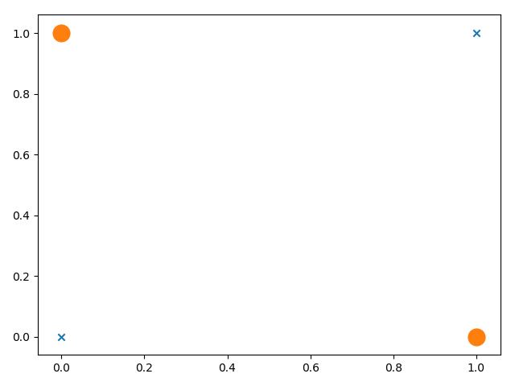
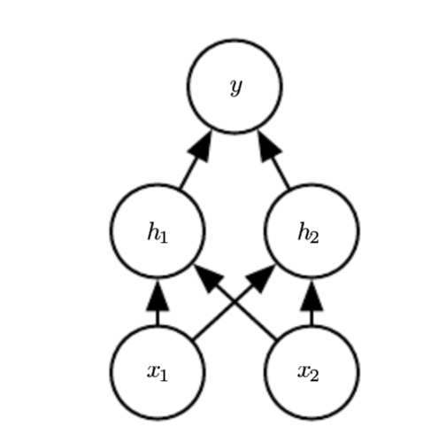

# Multilayer Perceptron

Perceptron 前面已经提到过了， Multilayer Perceptron 和 Perceptron 的区别就在于它是通过多层的 Perceptron 堆叠而成的，所以 Perceptron 是它的基础。在现在的很多资料中，都会提到 Multilayer Perceptron 是一种前馈人工神经网络，所以很多时候 Multilayer Perceptron 和 Neural Network 都会混在一起，有些时候，大家也用 Artificial Neural Network（ANN） 这个名词。这一章的重点就是 Multilayer Perceptron ，至于 Neural Network 更多的内容，会放在另一个章节里。

Perceptron 有一个不能解决问题，它不能解决 XOR 这样的问题。 XOR 问题说的是，有两个 Feature ($$\mathbf{x} =(x_1,x_2)$$)， 其中的每一个 Feature 的取值范围为 $$\{0，1\}$$ , 其对应的 Label 在 Feature 取不同值的时候为 1，相同值的时候为 0。如果在图像上画出这个整个数据集，很容易验证不能找到一根直线，把 Label 根据 Feature 取值分开：

仔细看 XOR 问题，可以发现它完全是一个二元分类问题，但是不能通过简单的线性分类器解决，所以 Perceptron 的使用条件中写到了数据集一定要是__线性可分__的，在 XOR 问题上，Perceptron 失效了。面对这个问题，简单直接的想法就是既然线性函数不行，那么就采用非线性的办法吧，如果这么想就会遇到另一个问题：_选择什么样的非线性函数来解决这个问题呢_？。这个问题实际上同样很难解决，对于非线性的问题，人们一直没有什么很好的办法，至少在我有限的知识里，没有什么办法。

解决非线性的问题，需要暂时提到一个已经证明的结论__经过有限次组合固定的单变量的线性函数，加上仿射变换，可以逼近任何的 n 元变量的连续函数__（稍微详细的说明，有空的话写在本节的附录部分）。注意到这个结论中没有要求连续函数是线性的，也就是已本 GitBook 已经提到的内容，可以通过有限次的组合 Perceptron 就能够逼近一个能够解决问题的非线性函数。看到这个结论，是不是有些人说，那么是不是说 Multilayer Perceptron 可以解决任何问题了？但是要注意的是，上面结论的限定条件：_n 元变量的连续函数_，如果最终能解决问题的函数不是连续函数，那么就不能用这个结论；_有限次_ 则是一个很模糊的说明，具体多少次也没有说，还有就是 _单变量_ 线性函数，那选择哪个单变量线性函数，也没有具体限制。所以这个结论是一个有用的开放的结论。

不过在 XOR 问题上，恰好可以使用简单堆叠 Perceptron 解决。那什么是堆叠 Perceptron 呢？

上面的图来自于[这里](http://deeplearning.net/tutorial/mlp.html)。

其中图上的 Input Layer 对应着输入，而 Output Layer 对应着输出，中间 Hidden Layer 中的每一个圆圈都代表一个 Perceptron。这样的具有 1 层 Input Layer ， 1 层 Hidden Layer ， 1 层 Output Layer 的结构，很多时候往往称之为 3 层 Neural Network ， 但在这里，我想暂时称之为 3 层 Perceptron 。面对现在要解决的 XOR 问题，可以设计一个 3 层神经网络，中间 Hidden Layer 有两个 Perceptron ， 最后的 Output Layer 则只有一个 1 个 Perceptron ，并将它的结果作为输出。上述对应的结构，示意如下：

这个多层结构来自于 Ian 的 Deep Learning 第 6 章。

# Model

这个解决 XOR 问题的 Multilayer Perceptron ，其对应的 model 一层层的来看。先看最后一层，它接收两个输入，所以可以直接定义为：

 $$y=\mathbf{w}^T_2 \cdot \mathbf{a}_2 + b $$ 
 

如果对比前面的 Perceptron 中 model 的定义，上面的这个东西之前的定义一模一样，这里的下标表示第 2 层，也就是输出层（由于输入层没有做任何事情，可以忽略）。同样的在前面的 Perceptron 最后的输出结果中，令其输出大于的时候结果为 1 ， 其他的时候结果为 0 。现在把这部分分段函数处理定义成一个函数，在 Neural Network 中称之为激活函数，这里也保留这个说法，表示成 $$\delta$$ 。那上面的第二层的 model 就可以改写为：

 $$y=\delta(\mathbf{w}^T_2 \cdot \mathbf{a}_2 + b )$$ 
 
