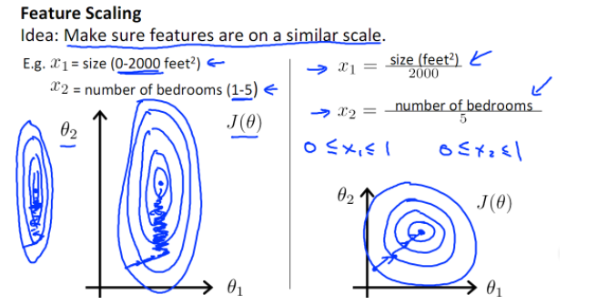

# Normalization

数据的标准化是指将数据缩放，使之落入一个特定区间，去除数据的单位，将其转化为无量纲的纯数值，便于不同单位或量级的指标能够进行比较和加权，典型的是归一化，即将数据映射到 $$[0,1]$$ 区间上。

normalization 有不少的优点：

* 有可能提升模型的收敛速度。

如上图，有两个模型参数，在特征未归一化前，损失函数的等高线形成一个狭长的椭圆，如果梯度下降的初始点选择的不合适，会导致下降路线是一个来回震荡的之字形，这样迭代的速度可能很慢，反之，归一化后，上述问题的损失函数的等高线变成了近似圆形，这样无论初始点选择在哪，迭代路线更加”直接”有效。

* 提升模型的精度：

在一些涉及到距离计算的算法时（如欧式距离），如果数据未经标准化，可能导致取值范围较小的特征对距离的贡献偏小，这会造成一定程度的精度损失。 因此在做数据分析前，往往需要先对数据进行标准化处理，利用标准化后的数据进行数据分析。

有些模型在各个维度进行不均匀伸缩后，最优解与原来不等价，如 SVM，对于这样的模型，需要归一化，有些模型在各个维度进行不均匀伸缩后，最优解与原来等价，如逻辑回归，对于这样的模型，虽然是否归一化理论上不会改变最优解，但是为了避免损失函数太扁，影响迭代，最好也进行数据标准化。基于平方损失的最小二乘法不需要归一化。

## 常用的标准化方法

* min-max

  也叫离差标准化，是线性变换，将原数据映射到 $$[0,1]$$ 区间内：

$$ x^* = \frac{x - \min }{\max  - \min }$$
 

* z-score

  最常见的标准化方法，也叫标准差标准化：

$$x^* = \frac{x - \mu }\sigma}$$
 

其中 $$\mu$$ 为样本均值，$$\sigma$$ 为样本标准差，此标准化方法适用于难于获得最大值和最小值的情况，优点是不改变样本的分布。

* log 函数转换

$$x^* = \log_{10}x$$
 

它能够把原本数值上相差很大的两个特征，经过变换后，数值上的差距变小，比如 $$x_1=10000,x_2=10$$ ，经过变换后，

$$x_1^* = 4,x_2^* = 1$$
 

* Decimal scaling 小数点标准化

通过移动小数点的位置使得数据落到 $$[−1,1]$$ 之间，小数点移动的位数和方向，取决于绝对值的最大值。如数据的取值区间为 $$[−123,321]$$ ，绝对值的最大值为 $$321$$，则将数据的小数点统一左移三位， $$−123$$ 变为 $$−0.123$$ ，$$321$$ 变为 $$0.321$$ 。

* $$\arctan$$ 函数转换

$$x^* = \frac{2 \cdot \arctan(x)}{\pi }$$
 

* sigmod 变换

$$x^* = \frac {1}{1 + \exp(-x)}$$
 
