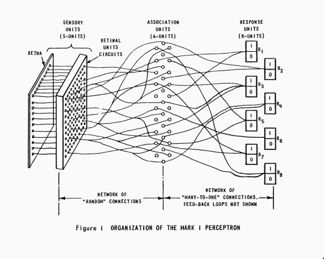
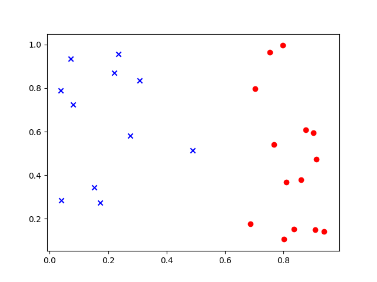

# Perceptron
Perceptron 是一个二元的线性分类器，最初由 Frank Rosenblatt 在 Cornell Aeronautical Laboratory 于 1957 年被发明。最初的想法是构建一台机器，而不是一个程序。 Perceptron 第一次在 IBM 704 机器上实现。然后他们设计了一个可以进行图像识别的物理机器，使用“连接主义”的思想，将输入图像和多个 Perceptron 的输入接口随机相连（如下图），得到最后输出的编码。

Perceptron 的应用场景是很有限，并且看起来简单易用。后来人们通过堆叠 Perceptron 得到了一个应用比单个 Perceptron 强有力的模型。堆叠 Perceptron 不是这一章的重点，重点还是看看 Perceptron 本身。

# Model
Perceptron 的核心思想就是将一个 $$n$$ 维的向量 $$x \in R_n$$ , 映射到一个只有 0 和 1 两个元素的集合 $$y$$ 上。用公式表示出模型就是来：

$$ f(x)=\begin{cases} 1, if \ w \cdot x + b \gt 0 \\ 0,\ otherwise\end{cases} $$

所以 Perceptron 的模型定义简单直接，接下来的重点就是要确定学习算法，这个学习算法能从数据集中自动的确定 $$w$$ 和 $$b$$ 的值。使用 Perceptron 的前提条件是数据集一定是线性可分的，如果数据集本身不能分成两类，那么就不能使用 Perceptron 。

# Data Set
假如我们现在手上又一个数据集 $$D=\{(\mathbf{x}_1,y_1),(\mathbf{x}_2,y_2),\cdots,(\mathbf{x}_N,y_N)\}$$ , 其中  $$\mathbf{x}_i \in \mathbb{R}^m,\ y \in \{0,1\}$$，并且要求这个数据集 $$D$$ 是线性可分的。首先，把问题退化最简单的情况，即 $$m=2$$ 的情况。如果把数据集 D 中的所有的点画到二维平面上，因为这个数据集 $$D$$ 是线性可分的，所以会出现如图所示的情况：

上面的红点的数据是：

    [[ 0.6863727   0.17526787  1.        ]
     [ 0.80132839  0.10523108  1.        ]
     [ 0.90775029  0.14932357  1.        ]
     [ 0.80961084  0.3694097   1.        ]
     [ 0.87508479  0.60748736  1.        ]
     [ 0.70281723  0.79587493  1.        ]
     [ 0.83433634  0.15264152  1.        ]
     [ 0.93900273  0.14149965  1.        ]
     [ 0.9024325   0.5952603   1.        ]
     [ 0.85962927  0.3794422   1.        ]
     [ 0.79602696  0.99582496  1.        ]
     [ 0.91271228  0.4730507   1.        ]
     [ 0.76601726  0.5419725   1.        ]
     [ 0.75340131  0.9640383   1.        ]]

而蓝色的叉对应的数据是：

    [[ 0.4891988   0.51442063  0.        ]
     [ 0.17261154  0.2748436   0.        ]
     [ 0.22090833  0.86894599  0.        ]
     [ 0.07946182  0.72304428  0.        ]
     [ 0.07177909  0.93407657  0.        ]
     [ 0.27563872  0.5806341   0.        ]
     [ 0.03817113  0.79038495  0.        ]
     [ 0.23544452  0.95657547  0.        ]
     [ 0.15161787  0.34464048  0.        ]
     [ 0.30645413  0.83393461  0.        ]
     [ 0.03985814  0.28320299  0.        ]]

数据集先放在这里，稍后会用到。如果 $$m \gt 2$$ 对应的情况就需要学习的数据集能用一个超平面可分。很多时候我们把 $$y$$ 称作标签。

数据可视化在面对低维度数据的时候是一个很重要的步骤。但是现实生活中经常遇到的情况是我面对高维度的数据集没办法可视化，在实际的工程中，人们的做法往往是修改构造数据的表示能让它适应所采用的算法。

# Learning Algorithm
Perceptron 是一个线性模型，由几何知识可以得到，如果存在一个超平面将数据分成两部分，那么数据点到平面的距离不为 0 。点到平面的距离计算公式：

$$d = \frac{|w \cdot x + b|}{||w||_2}$$

所有不在平面上的点都满足 $$d \neq 0$$。由于数据是有标签的，且 Perceptron 就需要根据标签把数据点分开，那么就有具有相同标签的点会出现超平面的一侧，切到超平面的距离 d>0。即如果标签的结果为 1 ， 那么应该有 $$(w⋅x+b)/||w||2 \gt 0 $$；类似的如果标签的结果不为 1 ，即有 $$(w⋅x+b)/||w||2 \lt 0$$。即 $$di=yi∗(w⋅xi+b)/||w||2 \gt 0$$。如果算出来 $$d \lt 0$$，那么就是出现了一个错误称之为 loss。

如果发现计算出来的距离结果不符合期望，那么可以采用 SGD 来降低这个损失：

$$\begin{array}\ dw_j = \frac{y_i \cdot x_{ij} \cdot ||w||_2 - \frac{w_j \cdot (w \cdot x + b)}{||w||_2} }{||w||^2_2} = y_i \cdot x_{ij} / ||w||_2 - w_j \cdot (w \cdot x + b) / ||w||^3_2 \\
db = y_i / ||w||_2 \end{array}$$

如果不考虑 $$||w||_2$$，上面式子变得更加简单，且对结果没有影响，计算也变得简单了:

$$\begin{array} \ dw_j = y_i \cdot x_{ij} \\  db = y_i\\ \end{array}$$

更新规则：

$$\begin{array} \ w = w - \eta \cdot dw \\ b = b - \eta \cdot db \\ \end{array}$$

这里的 $$\eta$$ 称之为学习率。

# Implementation

首先要定义 Perceptron 类：

    import numpy as np

    class Perceptron(object):
        """Perceptron Model"""

        w = None
        b = None

        def __init__(self):
            self.b = 0

        def __call__(self, x):
            return 1 if np.dot(self.w, x) + self.b > 0 else 0

        def loss(self, x, y):
            if self.w is None:
                self.w = np.random.uniform(0,1,(x.shape[0],))

            loss = -1 * y * (np.dot(self.w, x) + self.b)
            return loss

        def update(self, x, y, eta):
            dw = -1 * y * x
            db = -1 * y
            self.w = self.w - eta * dw
            self.b = self.b - eta * db

接下来要做的就是实现训练的逻辑：

    def train(model, x, y, eta = 0.1, epoch = 1):
        n = x.shape[0]
        error_point_num = 0
        epoch_num = 0

        for i in range(epoch):
            error_point_num = 0
            for j in range(n):
                if y[j] == 0:
                    y[j] = -1
                loss = model.loss(x[j], y[j])
                if loss >= 0:
                    model.update(x[j], y[j], eta)
                    error_point_num += 1
            if error_point_num == 0:
                break

            print("Epoch %d, Error Point Num: %d" % (i, error_point_num))
            epoch_num += 1

        print("Epoch %d, Error Point Num: %d" % (epoch_num, error_point_num))
最后要做的就是把上面的两部分组装起来：

    if __name__ == "__main__":
        data = np.array([[0.6863727, 0.17526787,  1.],
                         [0.80132839, 0.10523108, 1.],
                         [0.90775029, 0.14932357, 1.],
                         [0.80961084, 0.3694097,  1.],
                         [0.87508479, 0.60748736, 1.],
                         [0.70281723, 0.79587493, 1.],
                         [0.83433634, 0.15264152, 1.],
                         [0.93900273, 0.14149965, 1.],
                         [0.9024325,  0.5952603,  1.],
                         [0.85962927, 0.3794422,  1.],
                         [0.79602696, 0.99582496, 1.],
                         [0.91271228, 0.4730507,  1.],
                         [0.76601726, 0.5419725,  1.],
                         [0.75340131, 0.9640383,  1.],
                         [0.4891988,  0.51442063, 0.],
                         [0.17261154, 0.2748436,  0.],
                         [0.22090833, 0.86894599, 0.],
                         [0.07946182, 0.72304428, 0.],
                         [0.07177909, 0.93407657, 0.],
                         [0.27563872, 0.5806341,  0.],
                         [0.03817113, 0.79038495, 0.],
                         [0.23544452, 0.95657547, 0.],
                         [0.15161787, 0.34464048, 0.],
                         [0.30645413, 0.83393461, 0.],
                         [0.03985814, 0.28320299, 0.]])

        perceptron = Perceptron()
        train(perceptron, data[:,0:2], data[:,-1], 0.1, 30)
完整的代码把上面三段代码贴在一个文件中即可。可视化学习过程的效果就如下 gif 所示。

同样的 scikit-learn 也提供了相关的模型，用它实现会很轻松愉快：

    import scipy
    from sklearn.linear_model import Perceptron

    perceptron = Perceptron()
    perceptron.fit(data[:,0:2], data[:,-1])

# 收敛性的证明
关于 Perceptron 收敛性的证明网上有很多的材料，比如[这个](http://www.cs.columbia.edu/~mcollins/courses/6998-2012/notes/perc.converge.pdf)，感兴趣的是可以去详细了解的。需要记下的是，如果一个数据集是线性可分的，那么 Perceptron 算法一定会收敛。
