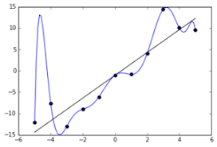
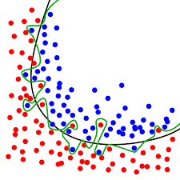

# Regularization

## overfitting and under-fitting

回归问题的欠拟合和过拟合：

分类问题的欠拟合和过拟合:

模型在 $$Train$$ 上的准确率上很高，在 $$Dev$$ 和 $$Test$$ 上表现的很差，这种情况叫做 overfiiting。如果模型在 $$Train$$ 上面表现的都很差的话，这种情况叫做 $$underfitting$$。前面的章节已经提到过，如果是 $$overfitting$$ 第一个需要做的事情就是增加数据量，降低模型的复杂度；而如果是 $$underfitting$$ 第一个要做的事情就是修改模型，让其能拟合数据。

## Regularization

构建模型其实是希望得到一个对测试集预测精度较高的模型，即能较好的拟合训练集同时又足够“简单”的模型（Occam's Razor），为了选出这样一个模型，典型的方法是在优化的目标函数中，加上一个随模型复杂度单调递增的正则化项或罚项：

$$w^* = \mathop {\arg \min }\limits_w \sum\limits_i {L(y_i,f(x_i;w)) + \lambda \Omega (w)}$$
 

模型参数如果变得很复杂， 那么 Loss 就会变大，惩罚项的目的在于找到一个模型对数据的拟合和模型本身的复杂度之间的一个平衡。Regularization 的函数 \\(Omega(w)\\)一般选择模型参数的范数，如零范数，一范数，二范数，迹范数，核范数等。

### \\(L_0\\) Norm

\\(L_0\\) 范数是指向量中非零元素的个数（\ \(L_0\\) 范数并不是范数），在多项式拟合中，模型参数的非零元素的个数越小，即参数向量越稀疏，则模型更趋向于简单化，一般情况下，如多元线性回归和逻辑回归中，它可以自动滤除对预测结果影响不大的特征，也就是把那些不怎么有用的特征的权重赋值为零，使得模型更加的简单，可读性更强，但是实际应用中，很少直接添加 \\(L_0\\) 正则化项，因为在优化问题中 \\(L_0\\) 范数的引入会使得模型很难求解。

### \\(L_1\\) Norm

\\(L_1\\) 范数是指向量中各个元素的绝对值之和，在实际应用中，需要添加 \\(L_0\\) 范数的正则化项往往用 \\(L_1\\) 范数替代，因为有如下定理支持：

> 任何一个规则化算子，如果它在 \\(wi=0\\) 的地方不可微，并且可以分解为一个求和的形式，那么这个规则化算子就可以实现稀疏

而 \\(L_1\\) 范数满足上述条件且比 \\(L_0\\) 范数更好求解，所以往往用 \\(L_1\\) 范数替代 \\(L_0\\) 范数。

### \\(L_2\\) Norm

\\(L_2\\) 范数是指向量中各元素的平方求和后再求平方根（向量的模），它可以使得模型参数 \\(w\\) 的每个元素尽量小但不一定等于零。所谓模型尽量简单，也就是预测模型尽量的平滑，模型局部尽量不要产生剧烈震荡，也就是预测函数对各个特征的偏导的绝对值不要太大，而各个特征的偏导往往是模型参数的单调递增函数，如上图的多项式回归，多元线性回归，逻辑回归等。此时在优化目标中加入二范数，一定程度上可使得预测函数平滑而简单，从而提升模型的泛化能力。

### Ridge Regression

在线性回归的 Loss 函数中加入 \\(L_2\\) Norm ，就成为了 Ridge Regression：

$$\hat w^* = \mathop {\arg \min }\limits_{\hat w} {(Y - X\hat w)^\mathrm{T}}(Y - X\hat w) + \lambda || {\hat w} ||_2^2$$
 

### Lasso

在损失函数中加入 \\(L_1\\) Norm，就是 Lasso Regression：

$$\hat w^* = \mathop {\arg \min }\limits_\hat w {(Y - X\hat w)^\mathrm{T}}(Y - X\hat w) + \lambda {|| {\hat w} ||_1}$$
 

### Elastic Net

在损失函数中加入 L1 和 L_2 Norm，就是 Elastic Net：

$${\hat w^*} = \mathop {\arg \min }\limits_{\hat w} {(Y - X\hat w)^\mathrm{T}}(Y - X\hat w) + {\lambda _1}\left\| {\hat w} \right\|_2^2 + {\lambda _2}{\left\| {\hat w} \right\|_1}$$
 
